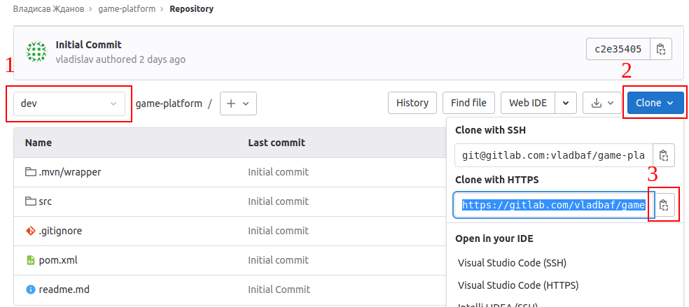
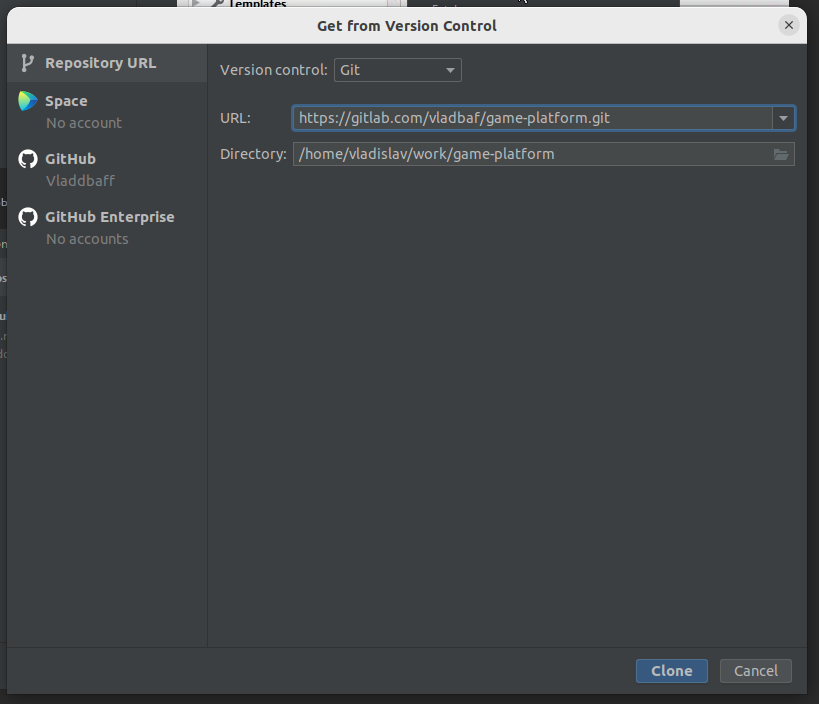
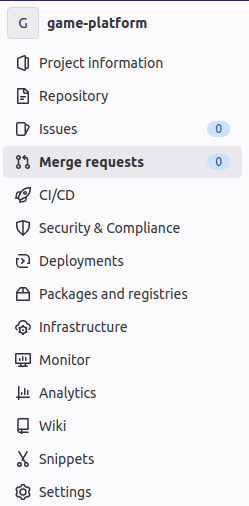
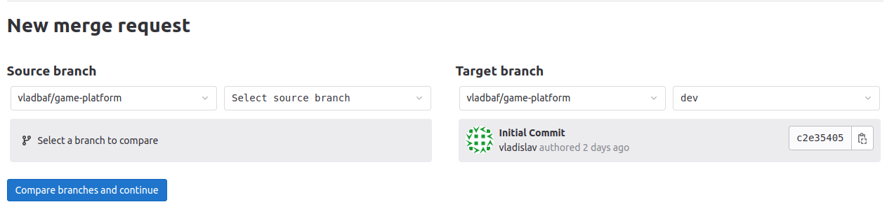

## Работа c git
> Важно! На нашем проекте вся работа ведется с master веткой. Этот гайд был взят с другого проекта. Там, где на скринах упоминатеся dev ветка, можно мысленно представлять master.
### Клонирование проекта

1. На странице репозитория убедитесь, что выбрана ветка **master** (1), нажмите кнопку **Clone** (2), скопируйте ссылку (3).

2. Откройте **Intellij IDEA**, нажмите **Get from version control** на экране приветствия, либо **VCS | Git | Clone...** в меню.

3. Вставьте скопированную ссылку в строку **URL**, нажмите **Clone**.

### Перед внесением изменений в код
Создайте новую ветку в git-репозитории и работайте в ней. Для этого:
1. Нажмите на текущую ветку **master** в правом нижнем углу и еще раз выберите ее в открывшемся окне.

2. Выберите **New Branch from...**.

3. Введите название своей новой ветки (#НомерЗадачи_суть_задачи_коротко) и нажмите **Create**.

### Добавление своего кода в общий репозиторий. Git push.

Прежде чем создать pull request (merge request) вам необходимо подготовить вашу ветку к отправке в общий репозиторий.

1. Нажмите на текущую ветку в правом нижнем углу. Выберите опцию **master | update**.
   Таким образом вы скачаете в свою локальную ветку **master** все коммиты которые были замержены,
   пока вы работали в своей ветке.

2. Убедитесь, что в данный момент активна ваша рабочая ветка (в нижнем правом углу экрана отображается название вашей ветки).
   Выберите опцию **master | Merge into Current**. Таким образом вы добавите все изменения из ветки **master** в вашу ветку. При возникновении конфликтов разрешите их.

3. ---**ВАЖНО**--- Убедитесь что проект собирается и запускается (выполните clean install в интерфейсе Идеи справа и запустите проект).

4. Выберите вашу ветку и нажмите на **Push...**, чтобы добавить её в общий репозиторий.

### Создание pull request / merge request

1. Создайте новый merge request. В качестве **Source branch** выберите свою ветку, **Target branch** - **master**.

2. Проверьте данные, допишите комментарии при необходимости. Обратите внимание на опцию **Delete source branch when merge request is accepted**.
   Завершите создание реквеста, перетащите таску в колонку Cross-review на доске, отправьте ссылку на pull request / merge request / ПР в канал проекта в Слаке и попросите коллег посмотреть ваш код.

