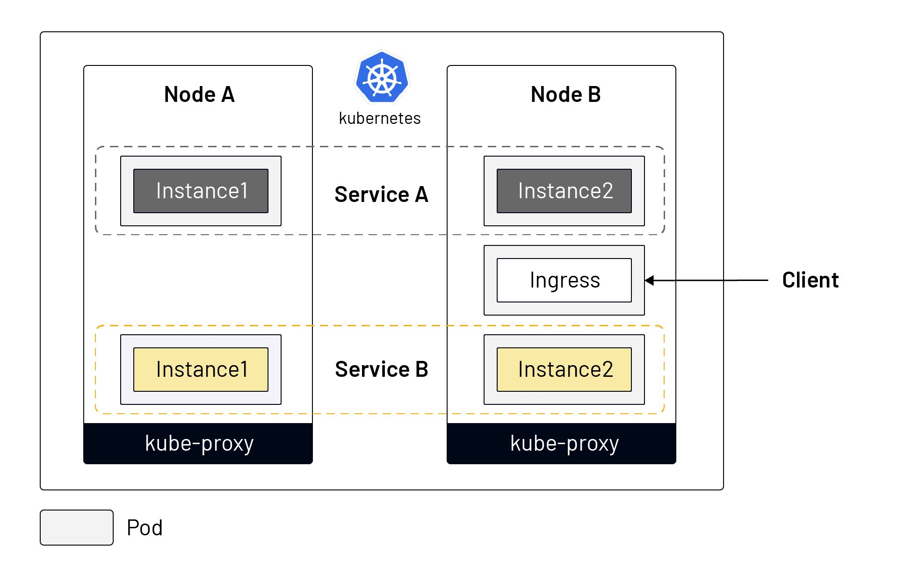
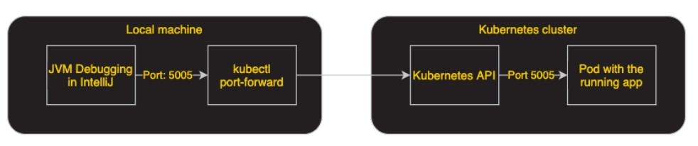
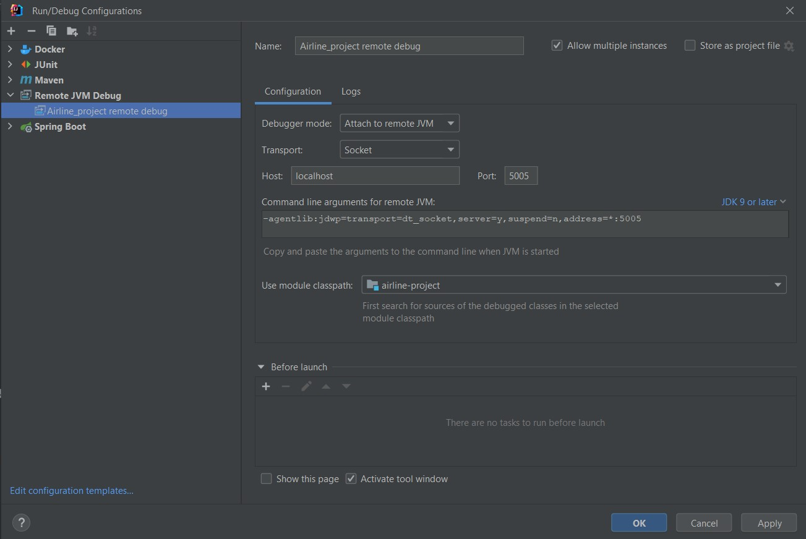
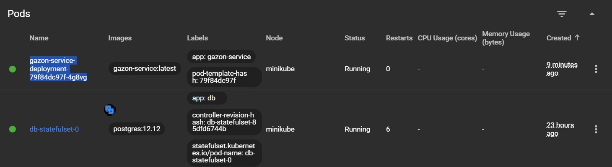
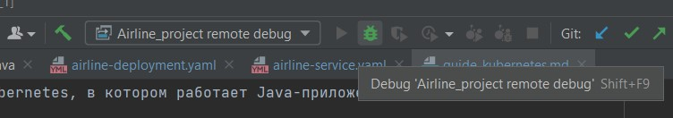

## Kubernetes

> Перед прочтением этого гайда обязательно ознакомьтесь с [гайдом по Докеру](./guide_docker.md), так как контейнеры - это основа Kubernetes.

Kubernetes - это платформа для декларативного управления контейнеризированными приложениями. Декларативность достигается за счет того, что вся конфигурация описывается в .yaml файлах (объекты Kubernetes), далее эти файлы передаются в кластер Kubernetes, и он сам заботится а том, чтобы кластер пришел к описанному в файле состоянию. Благодаря этому, становится возможным удобно управлять и масштабировать большие системы, построенные на микросервисной архитектуре.

[Видео](https://www.youtube.com/watch?v=QR_6Lvr3JSI) про Kubernetes

## Теория

Чтобы лучше понять, что такое микросервисы, надо знать основные виды архитектур:
1. <b>Монолитное приложение</b> - одно огромное приложение, над которым могут работать одна или несколько команд. Деплоится системными администраторами на один виртуальный или физический сервер. Если нагрузка на приложение высокая, и его необходимо масштабировать, то приложение деплоится на более мощный сервер (вертикальное масштабирование), либо деплоится полная копия этого приложения на другой сервер, и балансировщик нагрузки (легковесное приложение, основная задача которого - распределять трафик) передает им запросы (горизонтальное масштабирование). Это классический подход, именно такое приложение мы писали на Предпроекте. Подходит для небольших проектов, но не для больших систем.
2. <b>Сервис-ориентированная архитектура (SOA)</b> - огромный монолит дробится на меньшие модули, так называемые сервисы. Сервисы общаются друг с другом посредством брокеров сообщений (Kafka), REST, RPC. Над одним сервисом может работать как одна, так и несколько команд. Деплоится по-прежнему на виртуальные/физические серверы, но теперь этих серверов нужно гораздо больше, и нужны опытные системные администраторы, которые будут управлять и поддерживать всю эту систему. Масштабируется таким же образом, как и монолит. Подходит для высоконагруженных систем, но неудобен в разработке и эксплуатации. Если вы устраиваетесь на работу в большую компанию и слышите слово "легаси(legacy)", то под ним обычно имеется ввиду именно такой тип архитектуры. Ему на замеу был придуман следующий подход.
3. <b>Микросервисная архитектура</b> - так же, как в SOA, каждый микросервис отвечает за свою часть логики общей системы, но сервисы SOA дробятся на еще более мелкие модули, микросервисы, отсюда приставка 'микро'. Общаются микросервисы друг с другом так же, как и сервисы SOA. Один микросервис разрабатывается одной командой, при этом одна команда может разрабатывать несколько микросервисов. В отличие от предыдущих подходов, деплоем и управлением отведенным команде микросервисом занимается сама команда разработки (DevOps подход), отсюда вытекает необходимость разбираться в основах Kubernetes. Отдельные же специалисты, DevOps-инженеры, обычно занимаются управлением и поддержкой кластера Kubernetes целиком (кто-то же должен его еще развернуть). Масштабирование более прсстое и гибкое, чем в предыдущих подходах: достаточно одной команды или нескольких кликов (если работать через UI), либо можно настроить автоматическое масштабирование системы в случае увеличения нагрузки, и такое же автоматическое уменьшение количества реплик приложения, чтобы не тратить ресурсы, если нагрузка прошла, а Kubernetes сам займется распределением трафика. Важно отметить, что эта арихтектура подходит только очень крупным компаниям с большими нагрузками, при которых раскрываются преимущества такого гибкого масштабирования, например, крупным банкам. Небольшим компаниями микросервисы принесут только головную боль и лишние расходы, если нет опытных специалистов, способных эффективно поддерживать кластер Kubernetes.

> Несмотря на то, микросервисы можно писать и не на Kubernetes (например, на SpringCloud, которому посвящена значительная часть курса Advanced на платформе), микросервисы и Kubernetes стали практически тождественными понятиями, так как сейчас Kubernetes - это абсолютный стандарт построения микросервисов. При устройстве на работу, понимание Kubernetes и умение с ним работать, дает значительное преимущество над кандидатами без такого опыта.

##  Основные объекты Kubernetes:
<ul>
<li><b>Pod</b> - основная единица исполнения Kubernetes. Внутри Pod может быть один и более контейнер. Например, внутри Pod, в одном контейнере будет работать наше приложение, а во втором - вспомогательное приложение, которое будет собирать логи с нашего основного приложения и отправлять их в единое место для хранения и дальнейшего анализа (fluentbit). Обычно Pod самостоятельно не создается, его создает ReplicaSet.</li>
<li><b>ReplicaSet</b> - контролирует количество запущенных Pod одного типа (одного микросервиса). Это основной инструмент масштабирования приложений в Kubernetes. Обычно самостоятельно не создается, его создает Deployment.</li>
<li><b>Deployment</b> - абстракция над Pod и ReplicaSet, которая позволяет описать, как Kubernetes должен создать Pod: какой образ использовать, сколько реплик этого Pod следует создать, какие порты должны быть открытыми и др. Если разработчик хочет развернуть новый микросервис, то он должен создать Deployment, чтобы поднять Pod'ы, и Service, чтобы к этим Pod'ам можно было обратиться.</li>
<li><b>StatefulSet</b> - аналог Deployment для для приложений с состоянием: базы данных, кеши и др. (Опционально: <a href="https://habr.com/ru/company/timeweb/blog/703550/">Подробнее</a> про StatefulSet.)
<li><b>Service</b> - когда создается Pod, ему присваивается IP, и другие Pod'ы могут обращаться к этой Pod'е по ее IP. Однако Pod'ы постоянно умирают и поднимаются заново, и каждый раз им присваивается новый IP, поэтому существует Service. Service позволяет обращаться к Pod'ам одного типа по сатическому человекочитаемому названию, по сути это домен. Существует несколько типов Service:</li>

- ClusterIP - дефолтный тип сервиса. Используется для маршрутизации трафика внутри кластера.
- NodePort - позволяет обратиться к Pod извне кластера по IP ноды и выделенному порту (Node/нода - один из серверов, на которых развернут Kubernetes. Их всегда несколько, и вместе они формируют кластер Kubernetes). Если IP ноды поменяется, то обратиться к Pod'е по старому адресу будет невозможно, придется уведомлять пользователей о новом IP. По этой причине этот тип сервиса не используют в продакшене.
- LoadBalancer - более удобный аналог NodePort, позволяет обратиться к Pod извне кластера по постоянному выделенному IP, без порта. Если требуется предоставить публичный доступ к нескольким микросервисам (Pod'ам разного типа), то придется создавать несколько LoadBalancer, что неудобно и сопряжено с дополнительными расходами.
<li><b>Ingress</b> - аналог Service типа LoadBalancer, но без его недостатков. Один Ingress может перенаправить трафик на сколько угодно Service, которые в свою очередь перенаправят его на соответствующие Pod'ы. Именно эти объекты используют, чтобы предоставить доступ к нашим микросервисам конечному пользователю. Сам по себе объект Ingress не работает, ему нужно приложение, которое будет заниматься распределением трафика, так называемый Ingress Controller. Один из самых популярных - Ingress NGINX Controller.
<li><b>ConfigMap</b> - объект, в котором можно хранить и передавать нужную приложению информацию. Например, для микросервисов на спринге в ConfigMap обычно выносят application.yml. Это удобно, потому что можно поменять настройки application.yml внутри ConfigMap, перезагрузить Pod'у с приложением, и после ее перезапуска оно получит обновленную кофигурацию. Иначе нам бы пришлось полностью пересобирать приложение, менять его образ в Deployment и заново деплоить.</li>
<li><b>Secret</b> - аналог ConfigMap, но для конфиденциальных данных, например, пароль от БД. Информация в Secret сначала кодируется в <a href="https://www.utilities-online.info/base64/">base64</a>, а затем шифруется Encryption provider'ом - приложением для ширования и последующего дешифрования секретов. По-умолчанию Kubernetes не шифрует секреты, а только кодирует их, поэтому необходимо настроить Encryption provider самостоятельно.</li>
</ul>

### Другие материалы:
<ol>
<li><a href="https://www.youtube.com/watch?v=6HIXuufbdtk">Видео</a> про некоторые из упомянутых объектов</li>
<li>Короткая <a href="https://medium.com/google-cloud/kubernetes-101-pods-nodes-containers-and-clusters-c1509e409e16">статья</a> на английском про основы Kubernetes</li>
</ol>

Путь запроса пользователя в кластере Kubernetes с двумя worker-нодами и минимально необходимой конфигурацией:

<b>Бонус</b>: [Сказка](./images/Kubernetes_for_Kids_ITSummaPress.pdf) про Пышку
## Minikube

Minikube - это Kubernetes с одной нодой. Из-за этой особенности Minikube отлично подходит для изучения Kubernetes благодаря простоте настройки на локальном компьютере, но категорически не подходит для реальной работы из-за ненажедности (если одна единственная нода выходит из строя, то падает все система). Именно Minikube мы будем использовать на нашем проекте в качестве среды выполнения наших микросервисов.

[Установите](https://minikube.sigs.k8s.io/docs/start/) Minikube.

В терминале/powershell выполните команду <code>minikube start</code>, затем <code>minikube status</code>
Вывод должен быть такой:

- host: Running
- kubelet: Running 
- apiserver: Running
- kubeconfig: Configured

Чтобы остановить minikube, выполните команду <code>minikube stop</code>

Также вместе с Minikube на вашем компьютере была установлена <code>kubectl</code> - консольная утилита для работы с Kubernetes. С помощью нее можно создавать новые объекты, получать логи Pod'ы, увеличивать количество реплик и многое другое. 

## Kubernetes и наш проект

Ознакомьтесь с существующими Kubernetes-объектами в нашем проекте в директории deployments/k8s. Попробуем их развернуть:

1. Запустите Minikube <code>minikube start</code>
2. Находясь в директории deployments/k8s, выполните команду <code>kubectl apply -f gazon-db-statefulset.yaml</code>, чтобы развернуть БД
3. Выполните команду <code>kubectl apply -f gazon-db-service.yaml</code>, чтобы создать Service для БД 
4. Выполните команду <code>minikube image load gazon-service</code>, чтобы загрузить образ нашего основого приложения в кеш Minikube
5. Разверните оставшиеся объекты (ingress.yaml можно пока не трогать)
6. Выполните команды <code>kubectl get service</code>, <code>kubectl get deployment</code>, <code>kubectl get statefulset</code>, <code>kubectl get pod</code>, чтобы увидеть созданные вами объекты
7. Выполните команду <code>minikube dashboard</code>. У вас откроется браузер с графическим интерфейсом Kubernetes
8. Ознакомьтесь с дашбордом. Он позволяет взаимодействовать с Kubernetes в графической среде, что в некоторых случаях может быть удобнее, чем использовать kubectl. Здесь вы можете найти ранее созданные объекты. Попробуйте посмотреть логи нашего приложения. Для этого перейдите во вкладку Pods, нажмите на значок с тремя точками справа от нужной Pod'ы, нажмите Logs.

> Важно! В реальных проектах БД никогда не поднимается внутри кластера Kubernetes. БД следует задеплоить на отдельный сервер вне кластера Kubernetes, и Pod'ы одного микросервиса будут подключаться к одной БД. Однако для простоты мы деплоим Pod'у PostgreSQL прямо внутри кластера.

### Настройка доступа к кластеру
#### Способ 1. NodePort

Вспомним теорию. Service типа NodePort позволяет обратиться к Pod'е по IP ноды и выделенному этому Service'у порту. Minikube - это кластер Kubernetes, состоящий из одной ноды. Этой нодой является наш компьютер, соответственно адресом будет http://127.0.0.1 или http://localhost/. Осталось получить порт:
1. Выполните команду <code>minikube service gazon-service --url</code>
2. Перейдите по сокету (комбинация IP и порта), полученному на предыдущем шаге. Вы также можете перейти на http://localhost:{полученный порт}/, это приведет к тому же результату

Такой способ обращения к кластеру из внешнего мира допустим только на этапе разработки. Продакшн решение - это Ingress.

#### Способ 2. Ingress (работает только на Linux)
1. Создадим объект Ingress. Выполните <code>kubectl apply -f ingress.yaml</code>
2. Выполните команду <code>minikube addons enable ingress</code>. Эта команда автоматически настроит Ingress Controller (ранее я уже упоминал, что Ingress не работает сам по себе). В реальных условиях Ingress Controller настаивается несколько сложнее, но Minikube облегчает и этот аспект работы с Kubernetes
3. Теперь помимо наших ранее созданных прикладных Pod, в кластере существует Pod'а Ingress Controller'а, которая будет отвечать за получение трафика и дальнейшее его распределение внутри кластера. Чтобы увидеть эту Pod'у, выполните команду <code>kubectl get pods -n ingress-nginx</code>
4. Выполните команду <code>kubectl get ingress</code>. Под ADDRESS вы увидите IP, по которому Ingress принимает трафик. Вы можете уже сейчас попробовать обратиться к нашему приложению по этому IP.
5. Чтобы было возможно обратиться к приложению по домену, указанному в ingress.yaml, необходимо добавить строчку <code>{IP, полученный на предыдущем шаге} gazon-service.com</code> в файл hosts (<code>/etc/hosts</code> на Mac и Linux, <code>C:\Windows\System32\drivers\etc\hosts</code> на Windows). Для изменения этого файла требуются права администратора

> Если при обращении к http://gazon-service.com или по IP, полученному на шаге 4, вы получили таймаут (в браузере после долгого ожидания ошибка ERR_CONNECTION_TIMED_OUT), то на вашей системе не поддерживается minikube ingress. Например, на момент написания этого гайда, я на Mac с ARM процессором [не могу](https://github.com/kubernetes/minikube/issues/7332) настроить Ingress в minikube указанным выше способом. Чтобы это все-таки сделать, я должен либо применять не очень удобные [костыли](https://github.com/chipmk/docker-mac-net-connect), либо использовать [альтернативы](https://kind.sigs.k8s.io/) minikube. Делать мне этого не хочется, поэтому использую NodePort.

## Последние детали

В master ветку нашего репозитория постоянно заливаются ваши задачи. Соответственно, образ приложения, который вы забилдили ранее, устаревает. Нужно его обновить в нашем локальном репозитории и в minikube.

1. Удалим контейнер <code>docker rm gazon-service</code>
2. Удалим старый образ <code>docker image rm gazon-service</code>
3. Сделаем новый образ, находясь в корне нашего проекта <code>docker build -f Dockerfile_Gazon -t gazon-service .</code>
4. Запустим minikube <code>minikube start</code>
5. Остановим ранее запущенные Pod'ы проекта <code>kubectl --namespace default scale deployment gazon-service-deployment --replicas 0</code>
6. Удалим старый закешированный minikube'ом образ приложения (через 10-15сек. после предыдущей операции, чтобы пода успела остановиться) <code>minikube image rm gazon-service</code>
7. Закешируем свежий образ <code>minikube image load gazon-service</code>
8. Снова поднимем Pod'ы проекта <code>kubectl --namespace default scale deployment gazon-service-deployment --replicas 1</code>

Обратите внимание на скрипт deployments/k8s/sh/start-gazon-minikube.cmd (или .sh для Mac/Linux). С помощью него можно одной командой выполнить шаги 4-8.

> У всех Docker образов существует [docker tag](https://www.baeldung.com/ops/docker-tag) - уникальный идентификатор версии образа. Если во время создания образа его не указать явно, то присвоится tag latest, именно такой tag у образа нашего приложения. На реальных проектах каждому новому образу разрабатываемого приложения присваивают новую версию, уникальный tag, а сам образ сохраняется в репозитории компании, а не на устройствах разработчиков. Соответственно, не приходится явно удалять закешированные в кластере образы, как мы это делаем на учебном проекте. На примере нашего приложения в репозитории компании могли бы храниться образы <code>gazon-service:0.1.0</code>, <code>gazon-service:1.0.0</code>, <code>gazon-service:1.2.1</code> ([одна](https://wiki.merionet.ru/servernye-resheniya/113/chto-takoe-semanticheskoe-versionirovanie/) из стратегий версионирования программного обеспечения). На нашем учебном проекте мы не версионируем приложение, поскольку либо пришлось бы настраивать репозиторий образов (возможно, в будущем это сделаем), либо наши компьютеры замусорились бы ненужными образами.

## Удаленный дебаг (Опциональный раздел)

Удаленный дебаг позволяет подключаться к приложению, запущенному на сервере, а в нашем случае - в кластере Kubernates, используя средства дебага в Intellij IDEA на вашей локальной машине. В приложении, исправно работающем локально на вашей машине, могут возникать ошибки при запуске на удаленном сервере. Для удобной локализации ошибки в коде, и последующего исправления логики распространенным инструментом является remote debugging.

### Настройка удаленного дебага

Ключевой шаг в настройке - создание порта в Pod Kubernetes, в котором работает Java-приложение, и открытие его для доступа.

#### Настройка JVM remote debugging в Intellij IDEA.

1. Создайте Run Configuration нажатием на символ "+" в диалоговом окне Run -> Edit Configuration. Выберите Remote JVM Debug.
2. Задайте любое имя конфигурации.
3. Стандартный порт для удаленного дебага - 5005. Данный порт будет использоваться в нашем проекте.
4. Аргументы командной строки менять не нужно ( <code>-agentlib:jdwp=transport=dt_socket,server=y,suspend=n,address=*:5005</code> ).
5. Сохраните созданную конфигурацию.

#### Конфигурация Dockerfile и Kubernetes манифестов

Все файлы уже подготовлены. Подробную информацию можно получить [здесь](https://devsday.ru/blog/details/38207) и [здесь](https://medium.com/@caffeine.notes/удаленная-отладка-java-приложения-запущенного-в-kubernetes-контейнере-e35f4f3a79f2).

#### Запуск удаленного дебага

1. В дашбоарде (<code>minikube dashboard</code>) убедитесь, что все необходимые слои и поды работают. Скопируйте имя пода, на котором работает gazon_service_deployment (имя пода понадобится в дальнейшем):

2. Пробросьте порт Pod'а Kubernetes на порт локальной машины с помощью команды <code>kubectl port-forward <POD_NAME> 5005:5005</code> . Здесь <POD_NAME> - это имя Pod'a, скопированное на предыдущем шаге.
3. Запустите remote debug:

В консоли появится сообщение "Connected to the target VM, address: 'localhost:5005', transport: 'socket'". JMV подключилась к удаленной машине и готова к работе.

#### Работа с дебагом

Для отладки приложения:
1. Установите breakpoints в Intellij IDEA.
2. С помощью команды <code>minikube service gazon-service --url</code> получите URL для доступа к приложению в кластере Kubernetes. Обратите внимание, что ссылок несколько, так как в кластере несколько работающих сервисов. С большой долей вероятности необходимая нам ссылка на gazon-service первая.
3. В Postman указываете полученный на предыдущем шаге адрес и дополняете его до эндпоинта, на котором вы расставили breakpoints. Отправляете запрос.
4. В Intellij IDEA появится стандартный интерфейс дебагинга. Работайте с ним в привычном режиме.

## При возникновении ошибок

1. Проверьте, что браундмаузер windows (или фаервол другой операционной системы) не блокирует порт 5005. При необходимости выдайте этому порту разрешения.
2. Проверьте, что порт 5005 не используется на вашей машине другим процессом.
3. Ошибка может возникнуть из-за несоответствия версий JDK на вашей локальной машине и в кластере Kubernetes. Версия на локальной машине должна соответствовать или быть новее версии в контейнере.